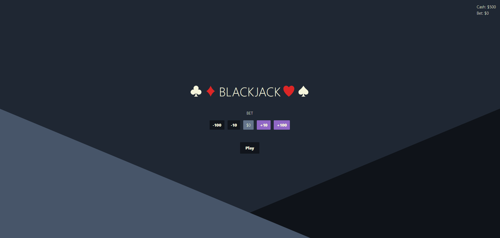

# Blackjack Web Application (Name TBD)

Welcome to my Blackjack web application, a modern take on the classic card game. This application let users play blackjack against a computerized dealer, with intuitive gameplay and a user-friendly interface.

[](https://blackjack1017.netlify.app/)

## Rules and Requirements

- Player wins by getting closer to 21 than the dealer, without going over 21
- Face cards are 10, Aces are worth either 1 or 11, any other card is worth its pip value
- Deck needs to be properly shuffled
- 2 cards are dealt to each player and dealer, clockwise; dealer's second card is face down
- Cards need to be dealt in the correct order
- Handle Aces as 11 (if score over 21, reduce Aces to 1)
- Stand (not ask for another card); dealer then draws
- Hit (ask for another card to get closer to 21); until stand or draw
- Dealer must hit if score is under 17
- If either the dealer or the player hit a natural, end game and calculate winner

## Features

- **Core Gameplay**: Play blackjack following standard rules - aim for a hand closer to 21 than the dealer's without going over.
- **Natural Blackjacks**: The game automatically detects and rewards natural blackjacks (awards 2.5x the bet amount).
- **Adaptive Dealer**: The dealer follows conventional casino rules, hitting until their hand value is at least 17.
- **Game State Management**: the application efficiently manages and updates the game state, ensuring a seamless gaming experience.
- **Hitting**: Players can hit to draw another card until they go over 21.
- **Win conditions**:

  | Player \ Dealer | under 21    | exactly 21  | bust        | natural     |
  | --------------- | ----------- | ----------- | ----------- | ----------- |
  | **under 21**    | Max wins    | Dealer wins | Player wins | Dealer wins |
  | **exactly 21**  | Player wins | Draw        | Player wins | x           |
  | **bust**        | Dealer wins | Dealer wins | Dealer wins | x           |
  | **natural**     | Blackjack   | x           | x           | Draw        |

## Additional Features

- **Betting System**: Start with a default cash amount and place bets each round. Adjust your bet size between rounds.
- **Double Down**: Players can choose to double down on their bet after the initial deal.
- **User Interface**: The application showcases a user-friendly UI that shows all the buttons and information in a simple and intuitive manner.

## Tech Stack

- [React](https://reactjs.org/): A JavaScript library for building user interfaces.
- React Hooks: For local state management
- [Tailwind CSS](https://tailwindcss.com/): A utility-first CSS framework for rapidly building custom user interfaces.
- [TypeScript](https://www.typescriptlang.org/): An extension of JavaScript that adds static typing.

## Getting Started

To get a local copy of this website up and running, follow these steps (you will need to install either [Node](https://nodejs.org/en/download) or [Yarn](https://classic.yarnpkg.com/lang/en/docs/install/#windows-stable)):

1. **Clone the repository:**

   ```shell
   git clone https://github.com/brng1017/blackjack
   cd blackjack-web-app
   ```

2. **Install dependencies:**

   Using npm:

   ```shell
   npm install
   ```

   Or using Yarn:

   ```shell
   yarn
   ```

3. **Run the development server**

   To start the app locally:

   ```shell
   npm run start
   ```

   Or using Yarn:

   ```shell
   yarn start
   ```

   The application will be available at http://localhost:3000 in your web browser.

4. **Build the website:**

   ```shell
   npm run build
   ```

   This will generate a production-ready version of the website in the `build` folder.

5. **Deploy the website:**

   You can deploy the website to various hosting platforms, such as [Netlify](https://www.netlify.com/), [Vercel](https://vercel.com/), or [GitHub Pages](https://pages.github.com/). Choose the one that suits your needs and follow their deployment instructions.

## Possible Future Additions

- centralized state, like Redux, instead of prop drilling
- can add functionality for more than one deck used
- use classes intead of interfaces to create instances for creating objects
- can add a backend and database configuration for multiplayer
- handle splitting pairs
- add animations and better styling
- add mobile styling
- insurance betting
- add unit testing using Jest
